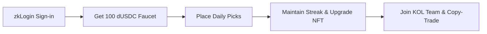

# 🎏 IppoStreak

> **DeepBook & Prediction Markets Track • Sui Overflow 2026**
> 
> A free-to-play, zero-friction prediction season platform built on Sui. Powered by DeepBook Predict, zkLogin, and Sponsored Transactions. 🚀

---

## 🛑 The Problem: The Web3 Onboarding Barrier

DeFi and prediction markets (e.g. Polymarket) have massive potential, but they face three major hurdles:
*   **The Onboarding Cliff:** Traditional prediction apps gate casual fans. Forcing users to install wallets, bridge assets, and acquire gas tokens before their first pick kills conversion.
*   **Thin Long-Tail Liquidity:** DeepBook Predict requires consistent transaction volume across all strikes and expiries to mature its SVI (Stochastic Volatility Indicator) surface. Professional arbitrage bots only concentrate on a few liquid strikes, leaving the long tail dry.
*   **Decay of Pure Speculation:** SocialFi apps frequently fail because they focus on pure token speculation rather than genuine utility, gameplay, and user retention.

---

## 🚀 The Solution: IppoStreak

**IppoStreak** is the zero-friction consumer gateway. It combines the engagement loops of fantasy sports with real on-chain settlement, making prediction markets accessible to everyone in under 30 seconds.

### ⚡ Key Features

*   **Zero-Friction Onboarding 🔑**
    Sign in with Google or Apple via **zkLogin**. No seed phrases, no extensions. A derived Sui address and `PredictManager` are generated behind the scenes in under 3 seconds.
*   **Gasless Play-to-Earn 💸**
    The first 10 picks are completely free (gas and faucet dUSDC are sponsored by the app), utilising Sui's native **Sponsored Transactions**. Users only touch real money once they are fully hooked.
*   **Real On-chain DeepBook Settlement 📈**
    Every daily binary pick triggers a real **`predict::mint`** against the DeepBook CLOB. This ensures all leaderboard standings and team performance records are fully auditable on-chain.
*   **Dynamic NFT Badges  Seahorse 🐚**
    Sui's mutable Move objects allow the user's Seahorse Badge to mutate in-place (Bronze ➡️ Silver ➡️ Gold) as their daily streak increases. This preserves history and social-graph references without wasteful burn-and-mint cycles.
*   **Team Mode (Social Copy-Trading) 👥**
    Followers can join a KOL leader's team. When the leader places a pick, all followers' positions are mirrored automatically in a single batched **Programmable Transaction Block (PTB)** to minimises gas fees.

---

## 🔄 User Loop

1.  **Onboard:** Tap "Continue with Google" to create a non-custodial wallet instantly.
2.  **Pick:** Slide to submit daily binary picks (e.g. BTC > $100k) with sponsored gas.
3.  **Streak:** Accumulate consecutive active days to upgrade your mutable Seahorse Badge NFT.
4.  **Team:** Subscribe to a leader's team to automatically mirror their strategies on-chain.

---

## 🛠️ Sui Primitives Composed

*   **DeepBook Predict:** Directly integrates with `predict::mint` and `predict::redeem` for authentic CLOB settlement.
*   **Mysten Enoki (zkLogin):** Abstracting Web3 onboarding into a standard OAuth flow.
*   **Sponsored Transactions:** Eliminating the gas friction for retail onboarding.
*   **Sui Move Object Mutability:** Enabling dynamic, in-place metadata upgrades for Seahorse NFT badges.
*   **Programmable Transaction Blocks (PTBs):** Batching up to 50 follower copies into a single atomic transaction.
