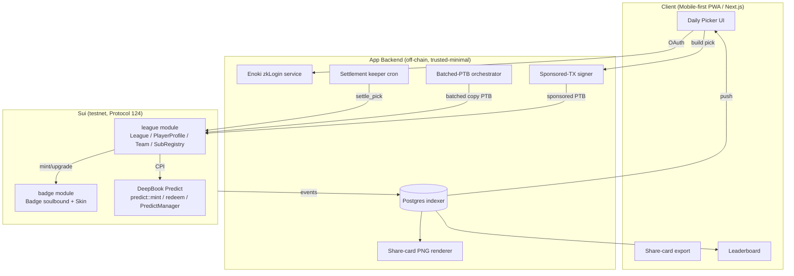
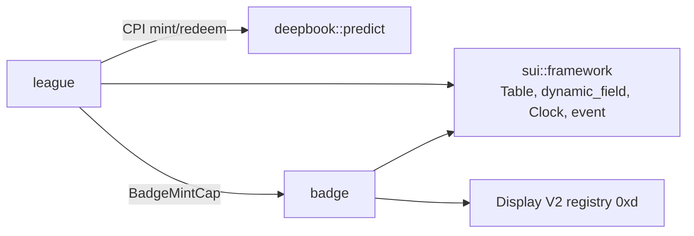
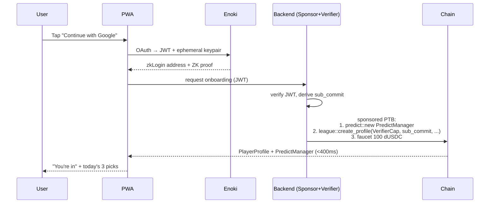
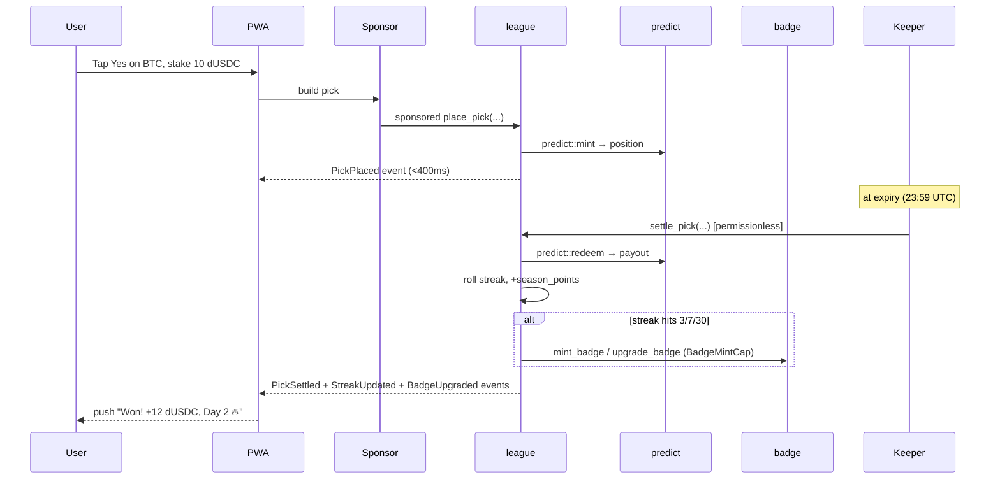

# PredictLeague — System Architecture Spec

> Track 2 · DeepBook & Prediction Markets · Sui Overflow 2026
> Derived from `BUSINESS_SPEC.md`. Target: SUI v1.72.2 / Protocol 124 (testnet).
> Date: 2026-05-30 · Status: Draft for hackathon implementation.

---

## 0. Locked Architecture Decisions

These five decisions are GTM-driven (see BUSINESS_SPEC §11) and frozen for the hackathon build. Everything below assumes them.

| # | Decision | Choice | GTM rationale |
|---|---|---|---|
| D1 | **Badge model** | Hybrid: soulbound `Badge` (`key` only) + tradeable `Skin` (`key + store`) attached via dynamic field. **Hackathon ships soulbound only**; `Skin` struct defined, market not wired. | Soulbound tier = track record can't be bought (the trust wedge). Skin market = v2 collectible/royalty economy. |
| D2 | **Settlement** | Permissionless `settle_pick` entry. App runs a keeper cron as the *default* executor, but anyone can call. | Narrative is trustless ("nobody can fake PnL"); ops stay controlled. Maps to BUSINESS_SPEC §9 + HANDBOOK #8. |
| D3 | **Team caps** | Product promise = **unlimited followers**. Implementation shards into cohorts of **≤50 per PTB**. | KOL is the Phase-1 funnel; a visible cap caps recruiting. Demo uses one 50-cohort batch. |
| D4 | **Question authorship** | `LeagueAdminCap`-gated. Registry shaped to accept community proposals later (v2). | Daily content must never gap (retention spine). Decentralizing questions is a v2 GTM beat. |
| D5 | **Anti-farming identity** | One `PlayerProfile` per zkLogin `sub`, enforced by an on-chain `SubRegistry` commitment. Streak/points weighted by real stake, not pick count. | Leaderboard credibility is the core GTM asset; farming destroys it for KOLs + sponsors. |

> ⚠️ **D5 trust caveat (flagged, not hidden):** true permissionless `sub`-uniqueness is impossible on-chain (a user can pick different zkLogin salts → different addresses from the same Google account). We enforce uniqueness via a backend-attested `sub` commitment gated by a `VerifierCap`. This is a **semi-trusted** component. Honest framing: the *settlement* and *picks* are trustless; the *identity uniqueness* leans on the app's JWT verifier. See §8.

---

## 1. Executive Summary (technical)

PredictLeague is a free-to-play prediction season built on **existing DeepBook Predict** primitives. We add exactly two Move modules — `league` and `badge` — and never fork Predict. The on-chain surface is deliberately tiny to keep audit scope minimal (BUSINESS_SPEC §9).

- **Picks** are real `predict::mint` calls wrapped in sponsored PTBs.
- **Settlement** is a permissionless `predict::redeem` path that also rolls streak + season points.
- **Engagement loop** = streak → dynamic NFT badge upgrade (in-place mutation, no burn).
- **Social loop** = on-chain `Team` membership + backend-batched copy-pick PTBs.
- **Onboarding** = zkLogin (Enoki) → derived address → auto `PlayerProfile` + `PredictManager`, all gas-sponsored.

The hard parts are off-chain orchestration (sponsored-tx signer, batched-PTB builder, settlement keeper, indexer); the on-chain parts are simple, auditable accounting + capability-gated admin.

---

## 2. System Context



**Trust boundary:** the chain holds all value + accounting. The backend can only (a) pay gas, (b) attest zkLogin `sub`, (c) trigger permissionless functions faster than a third party would. It cannot move user funds or fabricate picks/PnL.

---

## 3. Module Architecture

Two new modules. Dependency direction is one-way: `badge` depends on nothing in `league` (it's driven by `league` via capability), `league` depends on `predict`.



### 3.1 `league` module
The orchestration + accounting brain.

Responsibilities:
- Daily **question registry** (admin-gated publish, asset/strike/expiry + Predict market ref).
- **Player accounting** — streak, last-active day, season points, bound `sub`.
- **Identity uniqueness** — `SubRegistry`.
- **Team** membership + per-follower sizing cap + season pool split accounting.
- **Pick** entry (wraps `predict::mint`) and **permissionless settlement** (wraps `predict::redeem`, rolls streak/points, drives badge mint/upgrade via `BadgeMintCap`).

### 3.2 `badge` module
Dynamic NFT, deliberately dumb. Only `league` (holding `BadgeMintCap`) can mint/upgrade. No business logic lives here — it's a presentation object so the social graph + Display stay clean.

---

## 4. Data Structures

> Move 2024 edition. Pseudocode-level; field types final, function bodies in dev phase.

### 4.1 league

```move
/// Shared. One per season.
public struct League has key {
    id: UID,
    season: u64,
    questions: Table<u64, Question>,        // question_id -> Question
    next_question_id: u64,
    stats: Table<address, PlayerStat>,      // profile addr -> season accounting
    badge_cap: BadgeMintCap,                // F1: held INSIDE League; settle_pick borrows internally.
                                            //     NOT a caller-supplied arg — permissionless callers don't hold it.
    extra: Bag,                             // F4: future-proofing surface. Move forbids adding fields to a
                                            //     published struct; new league config goes here, not as new fields.
    paused: bool,
}

/// Admin authority (owned). Gates question publish + season config.
public struct LeagueAdminCap has key, store { id: UID }

/// Authority `league` holds to drive badge minting. `store`-only => not a standalone object;
/// lives embedded in `League.badge_cap`. Created once at init, never exposed to users.
public struct BadgeMintCap has store { /* phantom authority */ }

/// One per daily market. Binds our question to a real DeepBook Predict market.
/// NOTE (F2b): DeepBook Predict has NO `PredictMarket` object. A market is addressed by a
/// `MarketKey { oracle_id, expiry, strike, direction }` value (Copy+Drop+Store) that points at a
/// shared `OracleSVI`. We store that key + the oracle id; settlement reads OracleSVI.settlement_price.
public struct Question has store {
    id: u64,
    market_key: MarketKey,    // deepbook predict::market_key::MarketKey (asset+strike+expiry+direction)
    oracle_id: ID,            // ref to the shared OracleSVI for this market
    open_ms: u64,
    expiry_ms: u64,
    settled: bool,
}

/// Per-zkLogin-sub player object. Owned by the derived address.
public struct PlayerProfile has key {
    id: UID,
    owner_sub_commit: vector<u8>,   // commitment to zkLogin sub (D5)
    predict_manager: ID,            // ref to user's PredictManager
    created_ms: u64,
}

/// Season accounting, kept in League.stats (not in the owned object, so settlement can mutate it).
public struct PlayerStat has store {
    streak: u64,
    best_streak: u64,
    last_active_day: u64,           // UTC day index; streak resets on gap, NOT on wrong pick
    season_points: u64,             // f(correct picks × streak multiplier × stake weight)
    total_staked: u64,              // real-stake weighting for anti-farming (D5)
    open_picks: Table<u64, Pick>,   // question_id -> open pick
}

public struct Pick has store {
    question_id: u64,
    direction: u8,                  // maps to MarketKey.direction (call/put); replaces naive bool
    stake: u64,
    placed_ms: u64,
    //  NOTE (F2): no `predict_position: ID` needed. Predict positions live INSIDE the shared
    //  PredictManager.positions; we re-derive via MarketKey at settle time. Nothing for us to hold.
}

/// Shared. Enforces one profile per sub (D5).
public struct SubRegistry has key {
    id: UID,
    used: Table<vector<u8>, address>,   // sub_commit -> profile addr
}

/// Backend authority to attest a verified zkLogin sub commitment.
public struct VerifierCap has key, store { id: UID }
```

### 4.2 team

```move
/// Shared. One per team. Leader publishes picks; followers auto-copy.
public struct Team has key {
    id: UID,
    leader: address,
    fee_bps: u16,                   // 0..=500 (0–5%), platform takes 20% cut off this
    members: Table<address, Membership>,  // follower profile addr -> sizing
    member_count: u64,              // unlimited; orchestrator shards into ≤50/PTB (D3)
    season_realized: Table<address, u64>, // for 50% leader / 50% top-10 split
}

public struct Membership has store {
    per_pick_cap: u64,              // follower's max stake to copy per pick
    joined_ms: u64,
    active: bool,
}
```

### 4.3 badge

```move
/// Soulbound. `key` only — NO `store` => cannot enter Kiosk / be transferred (D1).
public struct Badge has key {
    id: UID,
    //  F5: dropped redundant `owner: address`. `key`-only already pins it to the holder; a stored
    //  copy would desync on any future custody change. Owner is read from the object, not duplicated.
    tier: u8,                       // 0 bronze, 1 silver, 2 gold
    minted_day: u64,
    streak_at_mint: u64,
}

/// Tradeable cosmetic (D1, v2). `key + store` => Kiosk-listable.
/// Attached to a Badge via dynamic_field; hackathon defines but does not wire the market.
public struct Skin has key, store {
    id: UID,
    skin_id: u64,
    royalty_bps: u16,
}
```

`Badge.tier` mutates in place on upgrade — same object ID, preserving social-graph refs + (future) resale history of attached skins. This is the Sui-specific "dynamic NFT, no burn-and-mint" flex (BUSINESS_SPEC §6.4).

---

## 5. Core Functions (signatures + intent)

> Predict-facing signatures verified against testnet package `0xf5ea…5138` (see Appendix). `predict::mint`
> and `predict::redeem_permissionless` are `public` (non-`entry`) → wrapped inside our `league` calls in a PTB.
> Real Predict deps: `&mut predict::Predict` (singleton shared), `&mut PredictManager` (per-player **shared**),
> `&OracleSVI` (shared), `MarketKey` (value), `u64`, `&Clock`. There is **no** `PredictMarket` object.

```move
// ---- admin (LeagueAdminCap-gated, D4) ----
public fun publish_question(_: &LeagueAdminCap, league: &mut League, market_key: MarketKey,
                            oracle_id: ID, open_ms: u64, expiry_ms: u64, clock: &Clock): u64;
public fun set_paused(_: &LeagueAdminCap, league: &mut League, paused: bool);

// ---- onboarding (sponsored; VerifierCap attests sub, D5) ----
public fun create_profile(_: &VerifierCap, reg: &mut SubRegistry, league: &mut League,
                          sub_commit: vector<u8>, predict_manager: ID, clock: &Clock,
                          ctx: &mut TxContext): PlayerProfile;
//  ^ aborts ESubAlreadyRegistered if sub_commit already in reg.used
//    predict_manager ID obtained from predict::create_manager (which shares the manager, returns ID)

// ---- pick (sponsored PTB wraps predict::mint) ----
public fun place_pick(league: &mut League, profile: &PlayerProfile, question_id: u64,
                      stake: Coin<DUSDC>, predict: &mut Predict, manager: &mut PredictManager,
                      oracle: &OracleSVI, clock: &Clock, ctx: &mut TxContext);
//  ^ aborts EQuestionClosed if clock >= expiry, EAlreadyPicked if open_picks has question, EPaused.
//    direction taken from the Question's MarketKey. Internally: predict::mint(predict, manager, oracle,
//    market_key, amount, clock, ctx). Funds settle into the shared PredictManager (no custody by us).

// ---- settlement (PERMISSIONLESS, D2) ----
public fun settle_pick(league: &mut League, profile_addr: address, question_id: u64,
                       predict: &mut Predict, manager: &mut PredictManager, oracle: &OracleSVI,
                       clock: &Clock, ctx: &mut TxContext);
//  ^ NO badge_cap arg (F1) — borrowed from league.badge_cap internally.
//    NO user cap needed: every arg is shared/value, so any keeper can call (D2). Wraps
//    predict::redeem_permissionless. Payout lands in the shared PredictManager; user withdraws later
//    with their own withdraw_cap (predict::withdraw) — custody stays trustless.
//    aborts: ENotExpired (clock < expiry); EOracleNotSettled (oracle.settlement_price is none — F2c:
//            clock-expiry alone is NOT enough, the OracleSVI must have posted a settlement price);
//            EAlreadySettled (idempotent no-op on re-call).
//    on win: +points; rolls streak by last_active_day gap; may mint/upgrade Badge via league.badge_cap.

// ---- team (D3) ----
public fun create_team(league: &League, fee_bps: u16, ctx: &mut TxContext): Team; // shared
public fun join_team(team: &mut Team, profile: &PlayerProfile, per_pick_cap: u64, clock: &Clock);
public fun leader_pick(team: &Team, profile: &PlayerProfile, /* same as place_pick */ ...);
//  followers copied off-chain: orchestrator emits one PTB per ≤50-cohort calling place_pick

// ---- badge (only via BadgeMintCap held by league settlement path) ----
public fun mint_badge(_: &BadgeMintCap, owner: address, streak: u64, day: u64, ctx): Badge;
public fun upgrade_badge(_: &BadgeMintCap, badge: &mut Badge, new_tier: u8, clock: &Clock);
```

---

## 6. Core Flows

### 6.1 Onboarding (under 30s, fully sponsored)



### 6.2 Daily pick → settlement → streak → badge



### 6.3 Team copy-pick (unlimited followers, ≤50/PTB)

```mermaid
sequenceDiagram
  participant Lead as Leader
  participant L as league
  participant Orch as Orchestrator
  participant Chain

  Lead->>L: leader_pick(...)
  L-->>Orch: LeaderPick event
  loop each cohort of ≤50 followers
    Orch->>Chain: one sponsored PTB:<br/>place_pick × 50 (capped per Membership.per_pick_cap)
  end
  Note over Orch,Chain: member_count unlimited;<br/>N cohorts = ceil(members/50) PTBs
```

---

## 7. Events, Errors, Capabilities

### Events (indexer-driven; all picks/streaks/teams reconstructable off-chain)
`ProfileCreated`, `QuestionPublished`, `PickPlaced`, `PickSettled`, `StreakUpdated`, `BadgeMinted`, `BadgeUpgraded`, `TeamCreated`, `TeamJoined`, `LeaderPick`, `FollowerCopied`.

### Error codes
| Code | Const | Where |
|---|---|---|
| 1 | `ESubAlreadyRegistered` | create_profile (D5) |
| 2 | `EQuestionClosed` | place_pick |
| 3 | `EAlreadyPicked` | place_pick |
| 4 | `ENotExpired` | settle_pick (D2): clock < expiry |
| 5 | `EAlreadySettled` | settle_pick (idempotency) |
| 11 | `EOracleNotSettled` | settle_pick (F2c): OracleSVI.settlement_price is none |
| 6 | `ECapExceeded` | follower copy > per_pick_cap |
| 7 | `ENotLeader` | leader_pick |
| 8 | `EInvalidTier` | upgrade_badge (no skip/downgrade) |
| 9 | `EPaused` | place_pick when league paused |
| 10 | `EBelowFeeFloor` / `EFeeTooHigh` | create_team fee_bps range |

### Capability summary
- `LeagueAdminCap` — publish questions, pause (D4). Owned by app multisig.
- `VerifierCap` — attest zkLogin sub on profile creation (D5). Owned by backend signer; **single point of identity trust, documented**.
- `BadgeMintCap` — mint/upgrade badges. Held only inside the `league` settlement path; never exposed to users.

---

## 8. Security & Threat Model

> Red-team vectors per project rule (≤5 attack classes). Core money/auth path = `place_pick` / `settle_pick` / `create_profile`.

| # | Vector | Attack | Defense |
|---|---|---|---|
| A1 | **Access-control bypass** | User calls `mint_badge`/`upgrade_badge` directly to fake gold tier | `BadgeMintCap` is unforgeable, held only by league; badge fns abort without it. No public mint. |
| A2 | **Multi-account farming** (D5) | One Google account → many salts → many profiles → farm sponsored gas + pollute leaderboard | `SubRegistry` rejects duplicate `sub_commit`; points weighted by `total_staked` not pick count; per-sub sponsored-tx rate limit off-chain. **Residual risk:** distinct Google accounts; mitigated by stake-weighting + gold tier requiring real-money entry (BUSINESS_SPEC §13). |
| A3 | **Settlement manipulation** | Attacker calls `settle_pick` early or twice to double-redeem / grief | Triple gate: `ENotExpired` (`clock < expiry`) + `EOracleNotSettled` (OracleSVI hasn't posted `settlement_price` — F2c: time alone is insufficient, the oracle is the real settlement authority) + `settled` flag idempotency (`EAlreadySettled`, re-call is a no-op). Permissionless is safe *because* settlement is oracle-gated + idempotent; we wrap `predict::redeem_permissionless`, which DeepBook itself exposes for keeper settlement. |
| A4 | **Economic exploit via team copy** | Follower sets huge `per_pick_cap`, or leader front-runs own followers | `ECapExceeded` clamps copy stake to `per_pick_cap`; followers mint *after* leader in the same orchestrated batch but against the same market price band; sizing is follower-controlled, not leader-controlled. |
| A5 | **DoS / gas grief on settlement** | Spam open picks to bloat `open_picks` Table; oversized team to blow PTB | `open_picks` keyed by `question_id` (bounded by daily question count, not user input); team copy sharded ≤50/PTB (D3) keeps each PTB within object/gas limits. |

**Identity trust disclosure (D5):** `VerifierCap` means the backend is trusted for *sub uniqueness only*. It cannot mint badges, move funds, or alter settled PnL. If the verifier is compromised, the worst case is leaderboard pollution (recoverable by re-issuing season), not fund loss. This boundary is intentional and stated in the pitch — settlement and picks remain trustless.

Full threat model → `docs/security/threat-model.md` (to be expanded in security phase via `sui-security-guard` + `sui-red-team`).

---

## 9. Ecosystem Tool Integration

| Need | Tool | Notes |
|---|---|---|
| OAuth onboarding | **zkLogin / Enoki** | Google + Apple; ephemeral keypair, JWT proof. `sui-zklogin`. |
| Gas-free onboarding + first N picks | **Sponsored TX** | Backend signer; per-sub rate limit. |
| DEX settlement | **DeepBook Predict** | `predict::mint/redeem`, `PredictManager`. Explicit `Move.toml` dep since v1.47. `sui-deepbook`. |
| Dynamic NFT display | **Display V2** (registry `0xd`) | In-place tier visual; activated on all networks (Protocol 124). |
| Tradeable skins (v2) | **Kiosk** | `Skin` `key+store`; royalty via transfer policy. `sui-kiosk`. |
| Indexer / analytics | **Custom indexer (gRPC)** | Postgres; streaks/teams/leaderboard. `sui-indexer`. gRPC is GA primary; GraphQL beta for frontend reads. |
| Share-card / skin assets | **Walrus** (optional v2) | Blob storage for badge art. |

> JSON-RPC is **deprecated** (Quorum Driver disabled, removal April 2026) — backend uses **gRPC**; frontend reads via **GraphQL beta**.

---

## 10. Data Layer

- **Current state reads** (open picks, balances) → gRPC.
- **Frontend list/leaderboard queries** → GraphQL beta + indexer cache.
- **Historical/aggregate** (season points, team PnL ranking, streak history) → **custom Postgres indexer** consuming events. Adaptive concurrency (`ConcurrencyConfig`, `Processor::FANOUT` removed in Protocol 124).

Leaderboard season_points are *also* on-chain in `PlayerStat` (source of truth); the indexer is a denormalized read cache for ranking/sorting.

---

## 11. Testing Strategy

- **Unit (sui-tester):** streak roll logic (gap reset vs wrong-pick no-reset — the §UC2 invariant), points formula, `SubRegistry` uniqueness, badge tier monotonicity, fee_bps bounds.
- **Integration:** full place→settle→streak→badge against a local Predict market mock; team copy with cap clamping.
- **Property/intent tests (Rule 9):** "streak only resets on missed *day*, never on wrong pick"; "settle_pick is idempotent"; "no path mints a badge without BadgeMintCap".
- **Monkey/extreme (project test rule):** settle before expiry, **settle after expiry but before oracle posts settlement_price (EOracleNotSettled)**, double-settle, duplicate sub, cap=0 follower, 50→51 cohort boundary, paused-league pick, max u64 stake.
- **Gas benchmark:** per-pick PTB cost; 50-follower batch cost vs 50 single txs (the §6.5 Sui flex).

---

## 12. Deployment Plan

1. **devnet** — `sui move build` + full test suite green; publish `league` + `badge`; wire to Predict testnet market.
2. **testnet (hackathon target)** — publish, run keeper cron, seed 1 demo team (1 leader + 3 followers), 3 daily questions, verify dynamic badge upgrade visible at Day 3.
3. **UpgradeCap** retained by app multisig. **F4 correction:** Move forbids adding/reordering fields on a *published* struct — "additive question fields" is NOT upgrade-safe. Forward-compat instead via the `League.extra: Bag` and per-`Question` dynamic fields; new versions add new structs/functions, never mutate existing layouts. `badge` frozen early (NFT immutability expectation).
4. Pre-deploy gate: `move-code-quality` → `sui-security-guard` → `sui-red-team` on core path (project Code Review rule).

---

## 13. Gas Optimization

- **Batched PTB** team copy = one tx for ≤50 follower mints (object reuse, single gas object).
- `PlayerStat` accounting kept in `League` shared Table so `settle_pick` mutates without touching the owned `PlayerProfile`. **Honest limit (F3):** this does NOT parallelize across players — every `place_pick`/`settle_pick` takes `&mut League` (plus shared `Predict`, `PredictManager`, `OracleSVI`), so all of them serialize through consensus on those shared objects. The win here is correctness/simplicity, not throughput. Demo-scale fine; if throughput ever matters, shard `stats` into per-cohort shared objects keyed by address range.
- Keep `Pick`/`Question` `store`-only (no UID where avoidable) to shrink object overhead.
- Daily-bounded `open_picks` Table (≤ daily question count per user) — no unbounded growth.

---

## 14. Open Questions Deferred to Dev Phase

(from BUSINESS_SPEC §14, non-architectural or v2)
- Premium pricing ($2.99/4.99/9.99) — pure product, no arch impact.
- Sponsor pool deal structure — off-chain treasury, no Move change.
- Telegram bot — v1 surface, reuses same `place_pick`.
- Token/DAO timing — v2; would add a `governance` module, out of hackathon scope.

---

## Appendix — Versions & verified on-chain refs

- SUI: v1.72.2 / Protocol 124 (testnet), mainnet v1.71.1 / Protocol 123.
- Move: 2024 edition.
- SDK: `@mysten/sui` (`Transaction`, not `TransactionBlock`).
- DeepBook Predict: explicit `Move.toml` dependency.
- Display: V2 (registry `0xd`).

### DeepBook Predict (testnet) — verified 2026-05-31 via JSON-RPC `getNormalizedMoveModulesByPackage`
- **Package:** `0xf5ea2b3749c65d6e56507cc35388719aadb28f9cab873696a2f8687f5c785138`
- **`Predict` singleton (Shared):** `0xc8736204d12f0a7277c86388a68bf8a194b0a14c5538ad13f22cbd8e2a38028a`
- **DUSDC quote type:** `0xe95040085976bfd54a1a07225cd46c8a2b4e8e2b6732f140a0fc49850ba73e1a::dusdc::DUSDC`
- **`PredictManager`:** `key`-only, **Shared** (verified instance owner=Shared), embeds `balance_manager` + `deposit_cap` + `withdraw_cap` + `positions`. Created via `predict::create_manager(ctx): ID`.
- **Key fns** (all `public`, non-`entry`): `mint`, `redeem`, **`redeem_permissionless`** (sig: `&mut Predict, &mut PredictManager, &OracleSVI, MarketKey, u64, &Clock, &mut TxContext`), `withdraw(&mut Predict, Coin, &Clock, ctx): Coin`, `available_withdrawal`, `supply`.
- **`MarketKey`** (`market_key`, Copy+Drop+Store): `{ oracle_id: ID, expiry: u64, strike: u64, direction: u8 }`.
- **`OracleSVI`** (`oracle`, `key`, Shared): `{ id, authorized_caps, underlying_asset: String, expiry, active, prices, svi, timestamp, settlement_price: Option<...> }` — `settlement_price.is_some()` is the settlement gate.
- Modules: `predict, predict_manager, vault, plp, oracle, oracle_config, market_key, range_key, registry, risk_config, pricing_config, treasury_config, strike_matrix, rate_limiter, math, i64, constants`.
- ⚠️ JSON-RPC used here for one-off introspection only; runtime backend must use gRPC (JSON-RPC removal April 2026).

*New Move surface = 2 modules (`league`, `badge`). No Predict fork. Audit scope minimal by design.*
